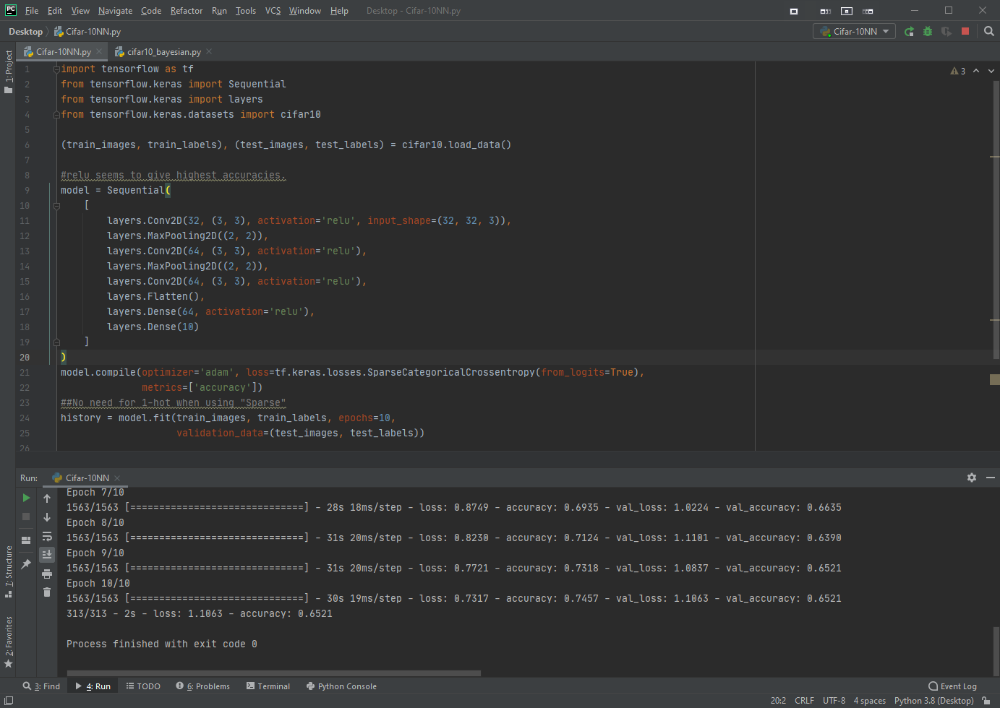

# Cifar-10NN
VERY Simple machine learining algorithm using Python and Tensorflow.
Identifies A class of a picture from [CIFAR10-dataset](https://www.cs.toronto.edu/~kriz/cifar.html)
Produces roughly 65% accurate program.

